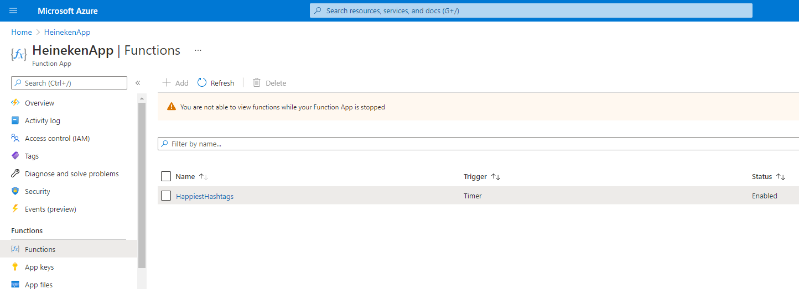

# Deploy Azure Function App locally
1. execute the command below in your terminal (root level)
```bash
func azure functionapp publish "HeinekenApp" --python
```
2. When deploying is successful:



# Change Management with Azure DevOps
See "ReleasePipeline-pipeline.yml" file and files in folder "pipelines" for the definitions for a build & release pipeline for the timer trigger function.